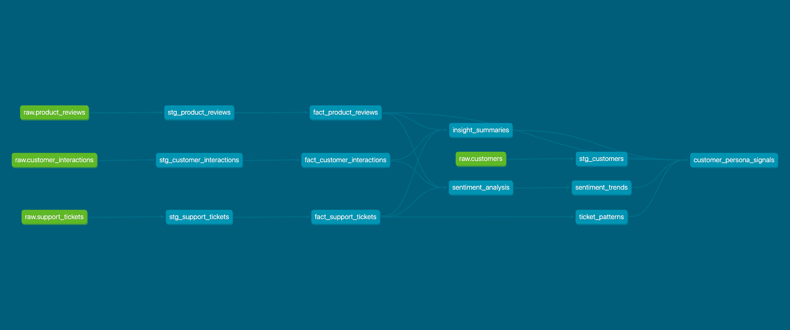

# 🧠 Snowflake + dbt + Cortex LLM Functions Quickstart 🚀

Welcome to this exciting hands-on guide where you'll discover how Snowflake Cortex LLM functions can transform your data analysis! This quickstart focuses on extracting hidden insights from customer data that would be impossible to uncover with SQL alone. 🔍

## 🎯 Business Value by Department 🎯

Let's explore how different departments can leverage these Cortex LLM-powered insights:

### 🛍️ Marketing

**Without Cortex LLM:**
- Segments customers based only on purchase history
- Manual review of feedback in English only
- Campaigns based on demographic data without sentiment context

**With Cortex LLM:**
- Targets campaigns based on detected customer sentiment and needs
- Automatically processes feedback in any language
- Identifies brand advocates with high positive sentiment
- Creates personalized messaging based on specific customer concerns

### 💰 Finance

**Without Cortex LLM:**
- Tracks only quantitative metrics like revenue and refunds
- Cannot predict customer churn from sentiment
- Missing context around billing complaints

**With Cortex LLM:**
- Forecasts revenue risk from sentiment trends
- Anticipates refund requests before they occur
- Identifies payment friction points from support tickets
- Prioritizes billing issues by detected urgency

### 💼 Sales

**Without Cortex LLM:**
- Relies on CRM data without sentiment context
- Misses upsell opportunities with satisfied customers
- Cannot prioritize retention efforts effectively

**With Cortex LLM:**
- Targets retention efforts on high-churn-risk accounts
- Identifies perfect timing for upgrade conversations
- Tailors pitches to address specific detected concerns
- Provides salespeople with sentiment-aware conversation starters

### 👥 HR

**Without Cortex LLM:**
- Evaluates support agents on limited metrics
- Manual review of customer interactions
- Generic training for all agents

**With Cortex LLM:**
- Identifies which agents excel at turning around negative sentiment
- Spots training opportunities based on customer frustration signals
- Creates targeted coaching based on specific interaction patterns
- Develops training from successful de-escalation examples

### 🎧 Customer Service

**Without Cortex LLM:**
- Tickets prioritized by age or manual review
- No advance warning of escalation risk
- Cannot anticipate specific customer expectations

**With Cortex LLM:**
- Auto-prioritizes tickets based on detected urgency and sentiment
- Identifies at-risk customers before escalation occurs
- Surfaces specific expected resolution timeframes
- Provides agents with sentiment context before conversations

## ✨ What You'll Learn ✨

In this guide, you'll:
- 📊 Set up Snowflake and dbt Cloud accounts
- 📁 Ingest nested JSON data with rich customer insights
- 🔄 Transform raw data using dbt models
- 🤖 Apply Cortex LLM functions to discover patterns and correlations
- 🧩 Uncover hidden customer sentiment and behavior patterns
- 📈 Create cross-departmental insights that drive business value

## 🏗️ Project Structure 🏗️

Your dbt project has the following structure:

```
dbt/
├── dbt_project.yml          # Project configuration
├── setup.sql               # Snowflake environment setup
├── models/
│   ├── staging/            # Staging models
│   │   ├── sources.yml     # Source definitions
│   │   ├── stg_customer_interactions.sql
│   │   ├── stg_product_reviews.sql
│   │   └── stg_support_tickets.sql
│   ├── fact/              # Fact models
│   │   ├── fact_customer_interactions.sql
│   │   ├── fact_product_reviews.sql
│   │   └── fact_support_tickets.sql
│   └── analysis/          # Analysis models
│       ├── sentiment_analysis.sql
│       ├── sentiment_trends.sql
│       ├── ticket_patterns.sql
│       ├── insight_summaries.sql
│       └── customer_persona_signals.sql
├── seeds/                 # Seed data files
└── macros/               # Reusable SQL macros
```

The Streamlit application is organized as follows:

```
streamlit/
├── cortex_analyst/       # Cortex Analyst files
├── src/                  # Streamlit application code
├── docs/                 # Streamlit documentation
├── deploy_streamlit_to_snowflake.sh # Deployment script
└── README.md             # README file
```

## 🏗️ Data Model Architecture 🏗️

Let's understand the data model we're building. The architecture consists of three main layers:

### 1. Source Layer (Raw Data)
- `CUSTOMER_INTERACTIONS` - Raw JSON containing customer interaction notes
- `PRODUCT_REVIEWS` - Raw JSON containing product reviews in multiple languages
- `SUPPORT_TICKETS` - Raw JSON containing support ticket details
- `CUSTOMERS` - Raw JSON containing customer profile data

### 2. Staging Layer (Cleaned Data)
The staging layer transforms raw JSON into structured tables:
- `STG_CUSTOMER_INTERACTIONS` - Parsed interaction data with standardized fields
- `STG_PRODUCT_REVIEWS` - Parsed review data with language identification
- `STG_SUPPORT_TICKETS` - Parsed ticket data with categorization
- `STG_CUSTOMERS` - Parsed customer profile data

### 3. Analytics Layer (Enriched Data)
The analytics layer adds AI-powered insights:
- `FACT_CUSTOMER_INTERACTIONS` - Interactions enriched with sentiment scores
- `FACT_PRODUCT_REVIEWS` - Reviews with sentiment analysis and translations
- `FACT_SUPPORT_TICKETS` - Tickets with priority scoring and resolution predictions
- `SENTIMENT_ANALYSIS` - Cross-channel sentiment tracking
- `SENTIMENT_TRENDS` - Temporal analysis of customer sentiment
- `TICKET_PATTERNS` - Support ticket behavior analysis
- `INSIGHT_SUMMARIES` - AI-generated customer interaction summaries
- `CUSTOMER_PERSONA_SIGNALS` - Comprehensive customer behavior profiles

### 📊 Entity Relationship Diagram (ERD)

### 🔄 Data Lineage (DAG)



The DAG above visualizes how data flows through our transformation pipeline:
- **Green nodes**: Raw source data
- **Blue nodes**: Transformed and enriched models
- **Arrows**: Dependencies between models

This lineage shows how we progressively enrich customer data, starting from raw JSON files and culminating in our comprehensive `customer_persona_signals` model.

## 🛠️ Prerequisites 🛠️

- Basic SQL knowledge
- Basic understanding of data transformation concepts
- Curiosity about AI-powered analytics! 😄

## 📝 Sign-Up for Required Services 📝

### 1. Create a Snowflake Trial Account
Sign up for a [Snowflake 30-day trial account](https://signup.snowflake.com/?utm=cortex-llm-dbt)

### 2. Create a dbt Cloud Trial Account
Sign up for a [dbt Cloud trial account](https://www.getdbt.com/signup/)

## 🏢 The Business Challenge: Unlocking Customer Insights 🏢

Our dataset contains rich customer behavior signals across interactions, reviews, and support tickets. Traditional SQL analysis would miss many of these insights, but with Cortex LLM functions, we can:

- 🔍 Discover hidden sentiment patterns in customer communications
- 🗣️ Process multilingual customer feedback without translation workflows
- 📊 Identify high-value customers at risk of churning
- 🚩 Flag potential escalation cases before they become critical
- 💡 Extract product improvement ideas from unstructured feedback

## 💾 The Dataset: Connected Customer Touchpoints 💾

Our synthetic dataset represents a complete customer journey with meaningful correlations:

1. `customer_interactions.json` - Customer interaction notes with sentiment signals
2. `product_reviews.json` - Product reviews in multiple languages with sentiment correlations
3. `support_tickets.json` - Support tickets with urgency and categorisation signals
4. `customers.json` - Customer profile data

The dataset contains several customer personas (satisfied, frustrated, neutral, mixed, new) whose behaviors are consistent across all three data sources—making it perfect for demonstrating how Cortex LLM functions can identify patterns that SQL alone would miss.

## 🚀 Let's Get Started! 🚀

### Step 1: Configure Snowflake ❄️

First, let's set up our Snowflake environment. The following SQL commands, also found in the `setup.sql` file in the `/dbt` folder, will prepare your Snowflake account.

**What `setup.sql` does:**
*   **Sets up Roles and Permissions:** Creates a `DBT_ROLE` and grants it necessary privileges for dbt to operate, adhering to the principle of least privilege where possible for the defined operations.
*   **Creates a Warehouse:** Establishes a dedicated `CORTEX_WH` warehouse for dbt and Cortex workloads.
*   **Creates Database and Schemas:** Sets up the `DBT_CORTEX_LLMS` database and the `DEV`, `STAGE`, `ANALYTICS`, and `SEMANTIC_MODELS` schemas.
*   **Defines File Formats and Stages:** Creates a `JSON_FORMAT` for ingesting JSON data and a `RAW_DATA_STAGE` for loading raw files.
*   **Creates Raw Tables:** Prepares transient tables to land the initial JSON data.

Run these commands in a Snowflake worksheet or execute the `setup.sql` script:

```sql
USE ROLE ACCOUNTADMIN;

-- Create role for dbt
CREATE OR REPLACE ROLE DBT_ROLE;

-- Assign role to ACCOUNTADMIN
GRANT ROLE DBT_ROLE TO ROLE ACCOUNTADMIN;

-- Create warehouse for dbt
CREATE OR REPLACE WAREHOUSE CORTEX_WH 
WITH 
    WAREHOUSE_SIZE = 'XSMALL' 
    AUTO_SUSPEND = 60
    AUTO_RESUME = TRUE;

-- Create database
CREATE OR REPLACE DATABASE DBT_CORTEX_LLMS;

-- Use the database
USE DATABASE DBT_CORTEX_LLMS;

-- Create schemas
CREATE SCHEMA IF NOT EXISTS DEV;
CREATE SCHEMA IF NOT EXISTS STAGE;
CREATE SCHEMA IF NOT EXISTS ANALYTICS;
CREATE SCHEMA IF NOT EXISTS SEMANTIC_MODELS;

-- Grant necessary privileges to the role
GRANT USAGE ON DATABASE DBT_CORTEX_LLMS TO ROLE DBT_ROLE;
GRANT CREATE DATABASE ON ACCOUNT TO ROLE DBT_ROLE;
GRANT MODIFY ON DATABASE DBT_CORTEX_LLMS TO ROLE DBT_ROLE;
GRANT MONITOR ON DATABASE DBT_CORTEX_LLMS TO ROLE DBT_ROLE;
GRANT CREATE SCHEMA ON DATABASE DBT_CORTEX_LLMS TO ROLE DBT_ROLE;

-- Grant schema privileges
GRANT ALL ON ALL SCHEMAS IN DATABASE DBT_CORTEX_LLMS TO ROLE DBT_ROLE;
GRANT ALL ON FUTURE SCHEMAS IN DATABASE DBT_CORTEX_LLMS TO ROLE DBT_ROLE;

-- Grant table privileges
GRANT ALL ON ALL TABLES IN DATABASE DBT_CORTEX_LLMS TO ROLE DBT_ROLE;
GRANT ALL ON FUTURE TABLES IN DATABASE DBT_CORTEX_LLMS TO ROLE DBT_ROLE;

-- Grant view privileges
GRANT ALL ON ALL VIEWS IN DATABASE DBT_CORTEX_LLMS TO ROLE DBT_ROLE;
GRANT ALL ON FUTURE VIEWS IN DATABASE DBT_CORTEX_LLMS TO ROLE DBT_ROLE;

-- Grant warehouse privileges
GRANT ALL ON WAREHOUSE CORTEX_WH TO ROLE DBT_ROLE;

-- Set the role for this session
USE ROLE DBT_ROLE;
USE WAREHOUSE CORTEX_WH;
USE SCHEMA STAGE;

-- Create file format for JSON data
CREATE OR REPLACE FILE FORMAT JSON_FORMAT
    TYPE = 'JSON'
    STRIP_OUTER_ARRAY = TRUE
    COMPRESSION = 'AUTO';

-- Create internal stage for seed files
CREATE OR REPLACE STAGE STAGE.RAW_DATA_STAGE;

-- Create raw tables
CREATE OR REPLACE TRANSIENT TABLE STAGE.CUSTOMER_INTERACTIONS (data VARIANT);
CREATE OR REPLACE TRANSIENT TABLE STAGE.PRODUCT_REVIEWS (data VARIANT);
CREATE OR REPLACE TRANSIENT TABLE STAGE.SUPPORT_TICKETS (data VARIANT);
CREATE OR REPLACE TRANSIENT TABLE STAGE.CUSTOMERS (data VARIANT);
```

### 🔒 A Note on Security

*   **Principle of Least Privilege:** While `ACCOUNTADMIN` is used in `setup.sql` for initial environment creation, it's a highly privileged role. For ongoing dbt development and operations, always use a role with the minimum necessary permissions, like the `DBT_ROLE` created in the setup. Avoid using `ACCOUNTADMIN` for routine tasks.
*   **dbt `profiles.yml`:** Your `profiles.yml` file contains sensitive credentials. Ensure this file is appropriately secured, especially if you are working in a shared environment or committing code to version control (it's often excluded via `.gitignore`). Consider using environment variables or other secure methods for credential management in production dbt deployments.
*   **Snowflake Network Policies:** For production environments, consider implementing Snowflake network policies to restrict access to your account from specific IP addresses.
*   **Regularly Review Permissions:** Periodically review the permissions granted to roles in Snowflake to ensure they are still appropriate.

### Step 2: Configure dbt Project

Create a new directory for your dbt project and set up the following files:

#### dbt_project.yml
```yaml
name: 'dbt_cortex'
version: '1.0.0'
config-version: 2

profile: 'dbt_cortex'

model-paths: ["models"]
analysis-paths: ["analyses"]
test-paths: ["tests"]
seed-paths: ["seeds"]
macro-paths: ["macros"]
snapshot-paths: ["snapshots"]

target-path: "target"
clean-targets:
    - "target"
    - "dbt_packages"

models:
  dbt_cortex:
    +database: DBT_CORTEX_LLMS
    staging:
      +schema: STAGE
      +materialized: view
    fact:
      +schema: ANALYTICS
      +materialized: table
    analysis:
      +schema: ANALYTICS
      +materialized: table
    semantic:
      +schema: SEMANTIC_MODELS
      +materialized: table

vars:
  dbt_cortex_database: DBT_CORTEX_LLMS
  raw_schema: STAGE
  analytics_schema: ANALYTICS
  semantic_schema: SEMANTIC_MODELS
  snowflake_warehouse: CORTEX_WH
```

#### models/staging/sources.yml
```yaml
version: 2

sources:
  - name: raw
    database: DBT_CORTEX_LLMS
    schema: STAGE
    tables:
      - name: customer_interactions
      - name: product_reviews
      - name: support_tickets
      - name: customers
```

#### models/staging/stg_customer_interactions.sql
```sql
-- Staging model for customer interactions
-- This model extracts and standardizes customer interaction information from the raw JSON data
-- Fields are cast to appropriate data types and renamed for clarity

SELECT
    data:interaction_id::VARCHAR AS interaction_id,
    data:customer_id::VARCHAR AS customer_id,
    TRY_TO_TIMESTAMP_NTZ(data:interaction_date::VARCHAR) AS interaction_date,
    data:agent_id::VARCHAR AS agent_id,
    data:interaction_type::VARCHAR AS interaction_type,
    data:interaction_notes::VARCHAR AS interaction_notes
FROM {{ source('raw', 'customer_interactions') }}
```

#### models/staging/stg_product_reviews.sql
```sql
with source as (
    select 
        data
    from {{ source('raw', 'product_reviews') }}
),

staged as (
    select
        data:review_id::varchar as review_id,
        data:customer_id::varchar as customer_id,
        data:product_id::varchar as product_id,
        TO_TIMESTAMP_NTZ(data:review_date::varchar) as review_date,
        data:review_rating::number as review_rating,
        data:review_text::varchar as review_text,
        data:review_language::varchar as review_language
    from source
)

select * from staged
```

#### models/staging/stg_support_tickets.sql
```sql
with source as (
    select 
        data
    from {{ source('raw', 'support_tickets') }}
),

staged as (
    select
        data:ticket_id::varchar as ticket_id,
        data:customer_id::varchar as customer_id,
        TO_TIMESTAMP_NTZ(data:ticket_date::varchar) as ticket_date,
        data:ticket_status::varchar as ticket_status,
        data:ticket_category::varchar as ticket_category,
        data:ticket_description::varchar as ticket_description
    from source
)

select * from staged
```

### Step 3: Set up dbt Profile

Create or update your `~/.dbt/profiles.yml`:

```yaml
default:
  target: dev
  outputs:
    dev:
      type: snowflake
      account: <your-account>  # e.g., xy12345.us-east-1
      user: <your-user>        # Your Snowflake username
      password: <your-password>  # Your Snowflake password
      role: ACCOUNTADMIN       # Initially ACCOUNTADMIN for setup, then consider DBT_ROLE
      database: DBT_CORTEX_LLMS
      warehouse: CORTEX_WH
      schema: RAW              # Default schema for dbt, often overridden in models
      threads: 4
```
**Note:** For initial setup and `dbt run` that creates schemas or has broad permissions, `ACCOUNTADMIN` (or a role with equivalent privileges) might be needed. For ongoing dbt development and runs, switch to `DBT_ROLE` or a similarly permissioned role.

### Step 4: Initialize and Test

From your project root, navigate to the `dbt` directory and run the following commands:

```bash
cd dbt
dbt deps
dbt debug
dbt run
```

**Understanding the `dbt` commands:**
*   `dbt deps`: This command downloads and installs any dbt packages (external libraries or collections of macros and models) listed in your `packages.yml` file (if you have one). For this quickstart, it might not be strictly necessary if no external packages are used, but it's good practice.
*   `dbt debug`: This command tests your dbt project's connection to Snowflake and displays helpful information about your project configuration, helping you troubleshoot any setup issues early on.
*   `dbt run`: This command executes all the SQL models in your dbt project, creating the tables and views defined in your `models/` directory in your Snowflake database.

### Step 5: Generate Documentation

After your models are running successfully, generate and view the documentation:

```bash
cd dbt
dbt docs generate
dbt docs serve
```

## 🌟 Setting up Cortex Analyst and Streamlit Visualization 🌟

To enable natural language querying with Cortex Analyst and to feed the Streamlit dashboard, we first need to deploy a semantic model to Snowflake. This model defines business-friendly metadata about your customer data.

### Step 1: Deploy the Cortex Analyst Semantic Model

The `streamlit/cortex_analyst/` directory contains the `semantic_model.yaml` file and a script (`upload_semantic_model.sh`) to upload it to a Snowflake stage.

**What is `semantic_model.yaml`?**

The `semantic_model.yaml` file is crucial for Cortex Analyst. It defines how your underlying database tables and columns map to business concepts, dimensions, and measures. This allows users to ask questions in natural language (e.g., "What was the average sentiment score for customers in Q3?") without needing to know SQL or the exact table structures.

Here's a simplified, illustrative example of what a part of `semantic_model.yaml` might look like:

```yaml
semantic_model:
  name: CustomerAnalytics
  description: "Semantic model for analyzing customer interactions, reviews, and tickets."
  
  entities:
    - name: customer
      description: "Represents a customer."
      table_ref: FACT_CUSTOMER_INTERACTIONS # Example table
      columns:
        - name: customer_id
          description: "Unique identifier for the customer."
        - name: sentiment_score
          description: "Sentiment score derived from interactions."
          agg: AVG # Allows asking for average sentiment

  dimensions:
    - name: interaction_date
      description: "Date of the interaction."
      column_ref: FACT_CUSTOMER_INTERACTIONS.INTERACTION_DATE # Example column
      type: TIME
      time_granularity: DAY
```
*(**Note:** This is a simplified example. The actual `semantic_model.yaml` in the quickstart will be more detailed and tailored to the project's schema.)*

**Deployment Steps:**

1.  **Navigate to the Cortex Analyst Directory:**
    Open your terminal and change to the `streamlit/cortex_analyst/` directory within this quickstart project.
    ```bash
    cd streamlit/cortex_analyst
    ```

2.  **Review Script Configuration (Important):**
    Open the `upload_semantic_model.sh` script. It defines several important variables:
    *   `SNOWFLAKE_DATABASE`: Should be `DBT_CORTEX_LLMS`.
    *   `SNOWFLAKE_SCHEMA`: Should be `SEMANTIC_MODELS`.
    *   `STAGE_NAME`: Defaults to `yaml_stage`.
    *   `YAML_FILE`: Defaults to `semantic_model.yaml`.
    Ensure these are suitable for your environment. **It is crucial that `SNOWFLAKE_DATABASE` and `SNOWFLAKE_SCHEMA` match where your dbt models were deployed and where the `setup.sql` script created the `SEMANTIC_MODELS` schema.** By default, it assumes your Snowflake CLI connection (`snowsql -c <connection_name>`) is already configured.

3.  **Make the Script Executable (If Necessary):**
    If you haven't already, make the script executable:
    ```bash
    chmod +x upload_semantic_model.sh
    ```

4.  **Run the Upload Script:**
    Execute the script from the `streamlit/cortex_analyst/` directory:
    ```bash
    ./upload_semantic_model.sh
    ```
    This script will perform the following actions using the Snowflake CLI:
    *   Create a schema named `SEMANTIC_MODELS` in your `DBT_CORTEX_LLMS` database if it doesn't already exist (though the `setup.sql` should have created it).
    *   Create a stage named `DBT_CORTEX_LLMS.SEMANTIC_MODELS.YAML_STAGE` (or your configured `STAGE_NAME`) if it doesn't exist.
    *   Upload the `semantic_model.yaml` file from the current directory to this stage, overwriting if it exists.

5.  **Create the Semantic Model in Snowflake:**
    After the YAML file is successfully uploaded to the stage, run the following SQL command in your Snowflake worksheet. Ensure you are using a role with the necessary permissions (e.g., `DBT_ROLE` if it has `CREATE SEMANTIC MODEL` privileges, or `ACCOUNTADMIN`):

    ```sql
    USE ROLE DBT_ROLE; -- Or another role with sufficient privileges like ACCOUNTADMIN
    USE DATABASE DBT_CORTEX_LLMS;
    USE SCHEMA SEMANTIC_MODELS;

    CREATE OR REPLACE SEMANTIC MODEL CustomerAnalytics
      FROM '@yaml_stage/semantic_model.yaml'
      TYPE = 'YAML';
    ```
    This command creates the `CustomerAnalytics` semantic model in the `DBT_CORTEX_LLMS.SEMANTIC_MODELS` schema, using the definition from the `semantic_model.yaml` file you just uploaded to the `yaml_stage`.

6.  **Verify Semantic Model Creation:**
    You can verify the semantic model in a few ways:
    *   **Snowsight UI:** Navigate to `Data` > `Databases` > `DBT_CORTEX_LLMS` > `SEMANTIC_MODELS` > `Semantic Models`. You should see `CUSTOMERANALYTICS` listed.
    *   **SQL Command:** Run `SHOW SEMANTIC MODELS IN SCHEMA DBT_CORTEX_LLMS.SEMANTIC_MODELS;` in a Snowflake worksheet. You should see your model in the results.
    *   **Cortex Analyst Query (Basic Test):** If you have tables like `FACT_CUSTOMER_INTERACTIONS` populated, you could try a very simple natural language query in Snowsight's Cortex Analyst interface (if available and configured for your account) referencing an entity or dimension from your model. For example: `Show me customers`. This step depends on data being present and Cortex Analyst features being enabled.

With the `CustomerAnalytics` semantic model deployed, business users can explore customer personas through natural language, and our Streamlit application can leverage these structured insights. 🚀

Next, we will deploy the Streamlit application itself.

## 📊 Deploying and Visualizing Your Insights with Streamlit

This section guides you through deploying the pre-built Streamlit application, "Customer Intelligence Hub," to your Snowflake account. This application allows you to visualize the customer analytics and insights derived from the dbt models and leveraging the Cortex Analyst semantic model you just deployed.

### Prerequisites for Streamlit Deployment

1.  **Cortex Analyst Semantic Model Deployed:** Ensure you have successfully deployed the `CustomerAnalytics` semantic model as described in the "🌟 Setting up Cortex Analyst and Streamlit Visualization 🌟" section above.
2.  **Snowflake CLI Installed and Configured:** Ensure you have the [Snowflake CLI (snowsql)](https://docs.snowflake.com/en/user-guide/snowsql-install-config) installed and configured with a connection to your Snowflake account. The deployment script uses a connection named `dbt` by default. You can update this in the script or ensure your `~/.snowflake/config.toml` defines this connection.
3.  **dbt Project Executed:** The underlying tables (e.g., `FACT_CUSTOMER_INTERACTIONS`, `CUSTOMER_PERSONA_SIGNALS`, etc. in the `ANALYTICS` schema) used by the semantic model and Streamlit app must exist. Make sure you have successfully run `dbt run` and that these tables are populated.
4.  **Streamlit Source Files:** You should have the `streamlit` directory from this Quickstart.

### Streamlit Application Deployment Steps

The `streamlit/deploy_streamlit_to_snowflake.sh` script automates the deployment of the Streamlit application. Here's a breakdown of what it does and how to use it:

1.  **Navigate to the Quickstart Root Directory:**
    Open your terminal and change to the root directory of this quickstart project (e.g., `dbt_cortex_analytics`).

2.  **Review Script Configuration (Important):**
    Open the `streamlit/deploy_streamlit_to_snowflake.sh` script in a text editor.
    At the top of the script, you'll find critical configuration variables. **Verify these carefully to match your Snowflake environment and dbt project setup:**
    ```bash
    # --- Configuration --- 
    SNOWFLAKE_CONNECTION_NAME="dbt" # Connection name in ~/.snowflake/config.toml (e.g., from snowsql -c <connection_name>)
    SNOWFLAKE_DATABASE="DBT_CORTEX_LLMS"    # Must match your dbt database
    SNOWFLAKE_SCHEMA="ANALYTICS"        # Schema where Streamlit app object will be created AND where it expects data tables
    SNOWFLAKE_WAREHOUSE="CORTEX_WH"     # Warehouse for the Streamlit app to use for queries
    SNOWFLAKE_STAGE_NAME="streamlit_app_stage" # Internal stage for app files (will be created in SNOWFLAKE_DATABASE.SNOWFLAKE_SCHEMA)
    STREAMLIT_APP_NAME="customer_intelligence_hub"
    MAIN_APP_FILE="streamlit_app.py" # The main Python file for your Streamlit app within the src directory
    APP_SRC_DIR="streamlit/src"      # Local directory containing your Streamlit app source files
    ```
    *   **`SNOWFLAKE_CONNECTION_NAME`**: Ensure this matches a valid connection configured in your `~/.snowflake/config.toml`.
    *   **`SNOWFLAKE_DATABASE`**, **`SNOWFLAKE_SCHEMA`**, **`SNOWFLAKE_WAREHOUSE`**: These **must** align with your dbt project setup and where the data tables (like `CUSTOMER_PERSONA_SIGNALS`) reside.
    *   The `SNOWFLAKE_SCHEMA` is also where the Streamlit app object itself will be created. For this quickstart, we use `ANALYTICS` for both data and the app object.

3.  **Make the Script Executable (If Necessary):**
    If you haven't already, make the script executable:
    ```bash
    chmod +x streamlit/deploy_streamlit_to_snowflake.sh
    ```

4.  **Run the Deployment Script:**
    Execute the script from the **root directory** of the quickstart project:
    ```bash
    ./streamlit/deploy_streamlit_to_snowflake.sh
    ```
    The script will perform the following actions using the Snowflake CLI:
    *   **Create a Snowflake Stage:** It ensures a stage (e.g., `streamlit_app_stage`) exists in your `DBT_CORTEX_LLMS.ANALYTICS` schema. This stage temporarily stores the application files.
        ```sql
        -- Example: CREATE OR REPLACE STAGE DBT_Cortex_LLMs.ANALYTICS.streamlit_app_stage;
        ```
    *   **Upload Application Files:** It copies files from your local `streamlit/src/` directory (including `utils/`, `components/`, `sql/`, `assets/`, `streamlit_app.py`, `__init__.py`, and `environment.yml`) to the Snowflake stage.
        The `environment.yml` file (located in `streamlit/src/`) specifies Python packages required for the Streamlit app (like `streamlit`, `pandas`, `plotly`). Snowflake uses this to set up the app's environment.
        Example upload command (internally, the script iterates over files and directories):
        ```bash
        # snow stage copy streamlit/src/utils @DBT_CORTEX_LLMS.ANALYTICS.streamlit_app_stage/utils/ --connection dbt --recursive --overwrite
        # snow stage copy streamlit/src/streamlit_app.py @DBT_CORTEX_LLMS.ANALYTICS.streamlit_app_stage/ --connection dbt --overwrite
        # snow stage copy streamlit/src/environment.yml @DBT_CORTEX_LLMS.ANALYTICS.streamlit_app_stage/ --connection dbt --overwrite
        ```
        *Note: Ensure your main app Python file is correctly named (e.g., `streamlit_app.py`) and matches the `MAIN_APP_FILE` variable in the script, and that it resides directly in the `APP_SRC_DIR` (`streamlit/src/`).*
    *   **Create the Streamlit Application in Snowflake:** Finally, it creates (or replaces) the Streamlit application in Snowflake using the files from the stage.
        ```sql
        -- Example: 
        -- CREATE OR REPLACE STREAMLIT DBT_CORTEX_LLMS.ANALYTICS.customer_intelligence_hub
        --   FROM '@DBT_CORTEX_LLMS.ANALYTICS.streamlit_app_stage'
        --   MAIN_FILE = 'streamlit_app.py'
        --   QUERY_WAREHOUSE = 'CORTEX_WH'
        --   TITLE = 'Customer Intelligence Hub';
        ```

5.  **Access and Verify Your Streamlit Application:**
    Once the script completes successfully:
    *   **Login to Snowsight:** Access your Snowflake account via the Snowsight UI.
    *   **Navigate to Streamlit Apps:** In the left-hand navigation menu, click on "Streamlit".
    *   **Locate Your App:** You should see your deployed application listed (e.g., "customer_intelligence_hub" or the name specified by `STREAMLIT_APP_NAME`). If you don't see it immediately, ensure you are looking in the correct database (`DBT_CORTEX_LLMS`) and schema (`ANALYTICS`).
    *   **Open and Test:** Click on the application name to open it. 
        *   The app should load and display its interface.
        *   Interact with different charts and features to ensure they load data correctly. This implicitly tests if the app can connect to the warehouse and query the necessary tables in the `ANALYTICS` schema.
        *   If you encounter errors within the app, check the app's logs if available or review that all prerequisite tables from `dbt run` exist and are populated.
    *   **Check App Details (Optional):** You can also run `SHOW STREAMLITS IN SCHEMA DBT_CORTEX_LLMS.ANALYTICS;` in a worksheet to see details about the deployed app, including its owner, warehouse, and main file.

    The app will use the `CORTEX_WH` warehouse (or your configured warehouse) to run queries against your `ANALYTICS` schema.

### Exploring the "Customer Intelligence Hub"

With the Streamlit dashboard deployed, your team can now:

- 👀 Visually identify customer sentiment patterns at a glance
- 🔍 Explore detailed customer profiles enriched by AI
- 🚨 Quickly spot and prioritize at-risk relationships
- 📊 Drill down into product feedback and support ticket trends
- 🧩 Analyze customer segments and their behaviors
- 📱 Access insights from any device with a web browser
- 🤝 Share the same view of customer health across departments

The interactive nature of the dashboard allows for exploration and discovery that static reports can't provide!

## 🔧 Troubleshooting / Common Issues

Here are a few common issues you might encounter and how to address them:

*   **dbt Connection Errors (`dbt debug` fails):**
    *   **Check `profiles.yml`:** Double-check your Snowflake account identifier (including region, e.g., `youraccount.us-east-1`), username, password, role, warehouse, and database settings in `~/.dbt/profiles.yml`.
    *   **Network/Firewall:** Ensure there are no network issues or firewalls blocking the connection to Snowflake.
    *   **Snowflake User/Role Permissions:** If using `DBT_ROLE` (or a custom role) in `profiles.yml` after the initial setup, verify it has `USAGE` on the database and warehouse, and necessary privileges on schemas.
    *   **Snowflake CLI/ODBC Drivers:** Ensure your dbt environment has the necessary Snowflake drivers installed and configured correctly.

*   **SQL Errors during `dbt run`:**
    *   **Object Not Found:** If dbt reports an object (table, view, schema) not found, ensure previous models creating those objects ran successfully. Check that schema and database names are consistent between your `dbt_project.yml`, model configurations, and your Snowflake environment.
    *   **Permission Denied:** The role dbt is using might lack permissions to create/read/write tables/views in a specific schema. Grant necessary privileges in Snowflake. (e.g., `GRANT ALL ON SCHEMA <schema_name> TO ROLE <dbt_role>;`).
    *   **Typos in SQL:** Carefully review the SQL in the failing model for syntax errors or incorrect column/table references.

*   **`upload_semantic_model.sh` or `deploy_streamlit_to_snowflake.sh` Script Failures:**
    *   **Snowflake CLI Not Installed/Configured:** Ensure the Snowflake CLI (`snowsql`) is installed and a connection (e.g., named `dbt`) is configured in `~/.snowflake/config.toml` or that you can pass connection parameters directly.
    *   **Permissions for Stage/Streamlit Creation:** The Snowflake role used by the CLI must have privileges to create stages, put files, and create Streamlit applications in the target database/schema.
    *   **File Paths:** Double-check that the script is being run from the correct directory and that paths to files like `semantic_model.yaml` or the `streamlit/src` directory are correct relative to where you execute the script.
    *   **Script Not Executable:** Remember to `chmod +x <script_name>.sh`.

*   **Streamlit App Shows Errors or No Data:**
    *   **Warehouse Not Running/Suspended:** Ensure the `QUERY_WAREHOUSE` (e.g., `CORTEX_WH`) for the Streamlit app is running and not suspended.
    *   **Underlying Tables Not Found or Empty:** Verify that the dbt models have run successfully and that the tables the Streamlit app queries (e.g., `CUSTOMER_PERSONA_SIGNALS` in the `ANALYTICS` schema) exist and contain data.
    *   **Schema Mismatch:** Ensure the Streamlit app is configured to query the correct database and schema where your dbt-transformed data resides.
    *   **Python Environment Issues:** Check the `environment.yml` for the Streamlit app. If it fails to build the environment in Snowflake, the app won't run. Look for compatible package versions.

*   **Cortex Analyst Semantic Model Issues:**
    *   **YAML Syntax Error:** If `CREATE SEMANTIC MODEL` fails, there might be a syntax error in your `semantic_model.yaml`. Validate the YAML structure carefully.
    *   **Table/Column Mismatches:** Ensure the tables and columns referenced in `semantic_model.yaml` exactly match the names in your Snowflake database (case sensitivity can matter depending on how objects were created).
    *   **Permissions:** The role creating the semantic model needs `CREATE SEMANTIC MODEL` on the schema and `USAGE` on the database. The role also needs `SELECT` access on the underlying tables the semantic model references.

## 📚 Resources 📚

- [Snowflake Cortex LLM Documentation](https://docs.snowflake.com/en/user-guide/cortex-llm)
- [dbt Documentation](https://docs.getdbt.com/)
- [dbt-Snowflake Integration Guide](https://docs.getdbt.com/reference/warehouse-setups/snowflake-setup)
- [Streamlit in Snowflake Documentation](https://docs.snowflake.com/en/developer-guide/streamlit/about-streamlit)

## 🎉 Congratulations! 🎉

You've successfully built an advanced customer analytics pipeline that leverages Snowflake Cortex LLM functions to extract insights that would be impossible with traditional SQL alone! You can now:

- 🔮 Predict customer behavior based on sentiment patterns
- 🗣️ Understand customer feedback in any language
- ⚠️ Identify at-risk relationships before they deteriorate
- 💡 Uncover improvement opportunities from unstructured data
- 🎯 Target your efforts on the customers who need attention most
- 📈 Visualize and share these insights across your organization

This foundation can be extended to solve countless business challenges by bridging the gap between structured data and human communication. Happy analyzing! ✨

## 🚀 Next Steps / Further Exploration

Congratulations on completing the Snowflake + dbt + Cortex LLM Functions Quickstart! Here are some ideas to build upon what you've learned:

*   **Customize and Extend dbt Models:**
    *   Add new data sources relevant to your business.
    *   Develop more sophisticated staging transformations.
    *   Create new analytical models using different Cortex LLM functions (e.g., `SNOWFLAKE.CORTEX.TRANSLATE`, `SNOWFLAKE.CORTEX.SUMMARIZE` on longer texts, or sentiment analysis with different granularity).
    *   Explore advanced dbt features like tests, snapshots, and seeds with your own data.

*   **Enhance the Semantic Model:**
    *   Add more entities, measures, and dimensions to your `semantic_model.yaml` to cover more analytical questions.
    *   Experiment with different aggregation types and relationships between entities.
    *   Explore calculated measures within the semantic model.

*   **Expand the Streamlit Application:**
    *   Add new pages or dashboards to visualize different aspects of the data.
    *   Incorporate more interactive elements and filtering options.
    *   Allow users to input text for on-the-fly analysis using Cortex functions called from Streamlit (via Snowflake User-Defined Functions or direct SQL execution).
    *   Experiment with other visualization libraries.

*   **Explore Other Cortex LLM Functions:**
    *   **Translation:** Use `SNOWFLAKE.CORTEX.TRANSLATE` to process customer feedback in even more languages.
    *   **Summarization:** Use `SNOWFLAKE.CORTEX.SUMMARIZE` for longer documents or interaction transcripts.
    *   **Text Generation/Completion:** Explore `SNOWFLAKE.CORTEX.COMPLETE` for tasks like drafting email responses based on ticket data and sentiment, or generating product descriptions.

*   **Operationalize the Pipeline:**
    *   Set up dbt Cloud jobs to run your dbt models on a schedule.
    *   Monitor model performance and data quality.
    *   Consider CI/CD practices for your dbt project and Streamlit application deployment.

*   **Deeper Dive into Snowflake Features:**
    *   Explore Snowflake Snowpark for more complex data transformations and ML model training in Python, Java, or Scala.
    *   Learn about Snowflake's native Machine Learning capabilities.
    *   Investigate data governance features like dynamic data masking and row-access policies for securing sensitive information in your analytics layer.

*   **Contribute or Provide Feedback:**
    *   If you have ideas for improving this quickstart or find any issues, consider contributing to the repository where it's hosted or providing feedback to the authors.

Happy innovating with Snowflake and Cortex! The possibilities are vast.
