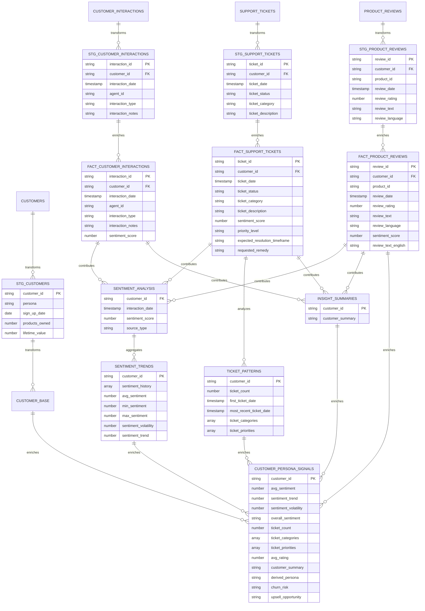

# Entity Relationship Diagram

```mermaid
erDiagram
    CUSTOMER_INTERACTIONS ||--o{ STG_CUSTOMER_INTERACTIONS : transforms
    PRODUCT_REVIEWS ||--o{ STG_PRODUCT_REVIEWS : transforms
    SUPPORT_TICKETS ||--o{ STG_SUPPORT_TICKETS : transforms
    CUSTOMERS ||--o{ STG_CUSTOMERS : transforms

    STG_CUSTOMER_INTERACTIONS ||--o{ FACT_CUSTOMER_INTERACTIONS : enriches
    STG_PRODUCT_REVIEWS ||--o{ FACT_PRODUCT_REVIEWS : enriches
    STG_SUPPORT_TICKETS ||--o{ FACT_SUPPORT_TICKETS : enriches
    STG_CUSTOMERS ||--o{ CUSTOMER_BASE : transforms

    FACT_CUSTOMER_INTERACTIONS ||--o{ SENTIMENT_ANALYSIS : contributes
    FACT_PRODUCT_REVIEWS ||--o{ SENTIMENT_ANALYSIS : contributes
    FACT_SUPPORT_TICKETS ||--o{ SENTIMENT_ANALYSIS : contributes

    SENTIMENT_ANALYSIS ||--o{ SENTIMENT_TRENDS : aggregates
    FACT_SUPPORT_TICKETS ||--o{ TICKET_PATTERNS : analyzes
    FACT_CUSTOMER_INTERACTIONS ||--o{ INSIGHT_SUMMARIES : contributes
    FACT_PRODUCT_REVIEWS ||--o{ INSIGHT_SUMMARIES : contributes
    FACT_SUPPORT_TICKETS ||--o{ INSIGHT_SUMMARIES : contributes

    CUSTOMER_BASE ||--o{ CUSTOMER_PERSONA_SIGNALS : enriches
    SENTIMENT_TRENDS ||--o{ CUSTOMER_PERSONA_SIGNALS : enriches
    TICKET_PATTERNS ||--o{ CUSTOMER_PERSONA_SIGNALS : enriches
    INSIGHT_SUMMARIES ||--o{ CUSTOMER_PERSONA_SIGNALS : enriches
    FACT_PRODUCT_REVIEWS ||--o{ CUSTOMER_PERSONA_SIGNALS : enriches

    STG_CUSTOMER_INTERACTIONS {
        string interaction_id PK
        string customer_id FK
        timestamp interaction_date
        string agent_id
        string interaction_type
        string interaction_notes
    }

    STG_CUSTOMERS {
        string customer_id PK
        string persona
        date sign_up_date
        number products_owned
        number lifetime_value
    }

    STG_PRODUCT_REVIEWS {
        string review_id PK
        string customer_id FK
        string product_id
        timestamp review_date
        number review_rating
        string review_text
        string review_language
    }

    STG_SUPPORT_TICKETS {
        string ticket_id PK
        string customer_id FK
        timestamp ticket_date
        string ticket_status
        string ticket_category
        string ticket_description
    }

    FACT_CUSTOMER_INTERACTIONS {
        string interaction_id PK
        string customer_id FK
        timestamp interaction_date
        string agent_id
        string interaction_type
        string interaction_notes
        number sentiment_score
    }

    FACT_PRODUCT_REVIEWS {
        string review_id PK
        string customer_id FK
        string product_id
        timestamp review_date
        number review_rating
        string review_text
        string review_language
        number sentiment_score
        string review_text_english
    }

    FACT_SUPPORT_TICKETS {
        string ticket_id PK
        string customer_id FK
        timestamp ticket_date
        string ticket_status
        string ticket_category
        string ticket_description
        number sentiment_score
        string priority_level
        string expected_resolution_timeframe
        string requested_remedy
    }

    SENTIMENT_ANALYSIS {
        string customer_id FK
        timestamp interaction_date
        number sentiment_score
        string source_type
    }

    SENTIMENT_TRENDS {
        string customer_id PK
        array sentiment_history
        number avg_sentiment
        number min_sentiment
        number max_sentiment
        number sentiment_volatility
        number sentiment_trend
    }

    TICKET_PATTERNS {
        string customer_id PK
        number ticket_count
        timestamp first_ticket_date
        timestamp most_recent_ticket_date
        array ticket_categories
        array ticket_priorities
    }

    INSIGHT_SUMMARIES {
        string customer_id PK
        string customer_summary
    }

    CUSTOMER_PERSONA_SIGNALS {
        string customer_id PK
        number avg_sentiment
        number sentiment_trend
        number sentiment_volatility
        string overall_sentiment
        number ticket_count
        array ticket_categories
        array ticket_priorities
        number avg_rating
        string customer_summary
        string derived_persona
        string churn_risk
        string upsell_opportunity
    }
``` 